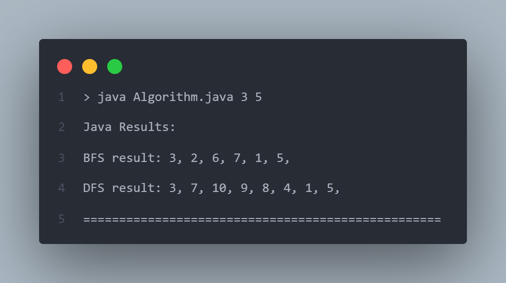
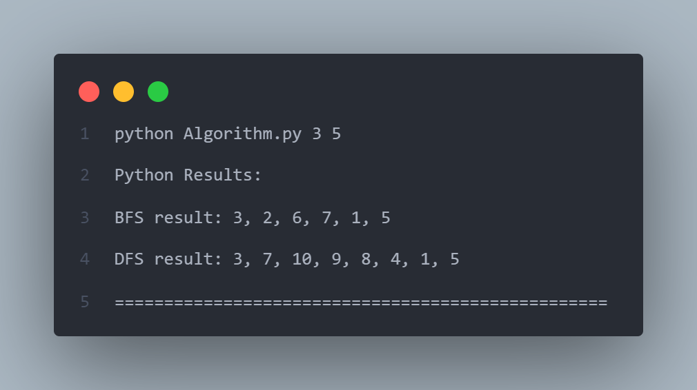
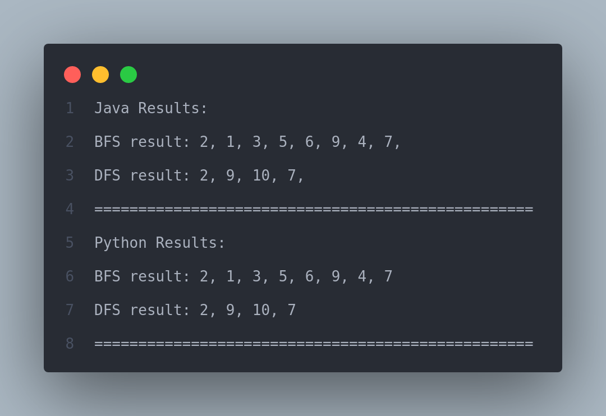

# BFS & DFS Algorithm implementation

In this project the BFS and DFS algorithms are implemented to have a better understanding of navigation algorithm and their time complexity.

A sample output of this project is shown below:

Although project is written in both java and python languages but the structure of the algorithm is the same in both of them.

## Project Files

`Algorithm.java`: This file contains the BFS and DFS algorithms written in java language.

To run this file manually, first add all your graph edges to `edges.txt` file and then run this command in your terminal:

```bash
java Algorithm.java X Y
```

By running this command, the java file will be executed and the results will be shown in the terminal. Here is a sample run:



`Algorithm.py`: This file contains the BFS and DFS algorithms written in python language.

To run this file, like the java file first add all your graph edges to `edges.txt` file and then run the correct command according to your operating system:

Windows:

```bash
python Algorithm.py X Y
```

Linux:

```bash
python3 Algorithm.py X Y
```

By running this command, the java file will be executed and the results will be shown in the terminal. Here is a sample run:



`BFS.pdf` and `DFS.pdf`: These files contain instructions and a sample run of both of the algorithms for further information and for understanding of the algorithms.

`edges.txt`: Contains all of our graph edges. Both the algorithm path find according to the edges written in this file. Edges in this file should be written in form of `X Y`. this denotes that there is an edge between node `X` and `Y`.

`results.txt`: This file contains the output of both algorithms.

`Run.bat`: By executing this file from windows terminal both algorithms in `Algorithm.java` and `Algorithm.py` will path find according to the user input.

`Run.sh`: Like the previous file, by executing this file from **_linux_** terminal both algorithms in both files will start path finding according to the user input.

## Running the project

To run this project first add all the graph edges to [edges.txt](./edges.txt) file in form of `X Y`. This denotes that there is an edge between nodes `X` and `Y`.

After that, to run the algorithm on the given data, run the given command according to your operating system:

### Windows

In windows simply execute the following command in the project directory:

```
Run.bat
```

and then provide two valid inputs as the the starting and target node to calculate the path between them:

```
Start Node (1-10) : 1
Target Node (1-10) (enter 0 for full traversal) : 3
```

### Linux

In linux execute the following command in the project directory:

```bash
./Run.sh X Y
```

where `X` is the starting node and `Y` is our destination node.

_Note: If you get the following error while running in linux:_

```
bash: ./Run.bat: Permission denied
```

_simply run this command to solve it:_

```
sudo chmod +x ./Run.sh
```

_This command allows the Run.sh file to be executed by the user._

After executing the correct command, the output of the algorithms will be shown. Also the output will be available in [result.txt](./result.txt) file as shown below.


