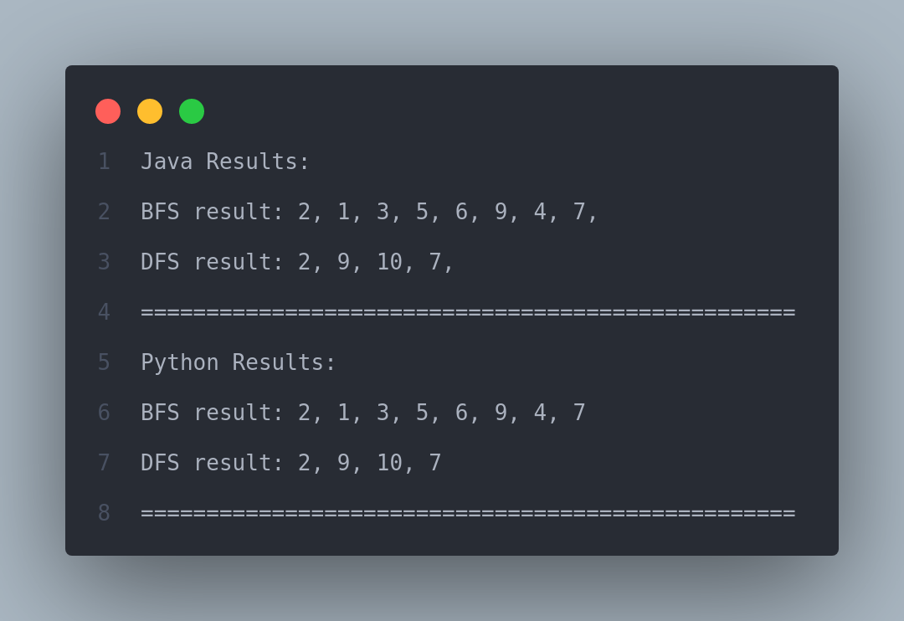

# BFS & DFS Algorithm implementation

In this project the BFS and GBFS algorithms are implemented to have a better understanding of navigation algorithm and their time complexity.

A sample output of this project is shown below:

Although project is written in both java and python languages but the structure of the algorithm is the same in both of them.

<hr>

## Project Files

## Running the project

To run this project first add all the graph edges to [edges.txt](./edges.txt) file in form of `X Y`. This denotes that there is an edge between nodes `X` and `Y`.

After that, to run the algorithm on the given data, run the given command according to your operating system:

### Windows

In windows simply execute the following command in the project directory:

```
Run.bat
```

and then provide two valid inputs as the the starting and target node to calculate the path between them:

```
Start Node (1-10) : 1
Target Node (1-10) (enter 0 for full traversal) : 3
```

### Linux

In linux execute the following command in the project directory:

```bash
./Run.sh X Y
```

where `X` is the starting node and `Y` is our destination node.

_Note: If you get the following error while running in linux, simply run this command_

Error:

```
bash: ./Run.bat: Permission denied
```

Solution:

```
sudo chmod +x ./Run.sh
```

After executing the correct command, the output of the algorithms will be shown. Also the output will be available in [result.txt](./result.txt) file as shown below.


