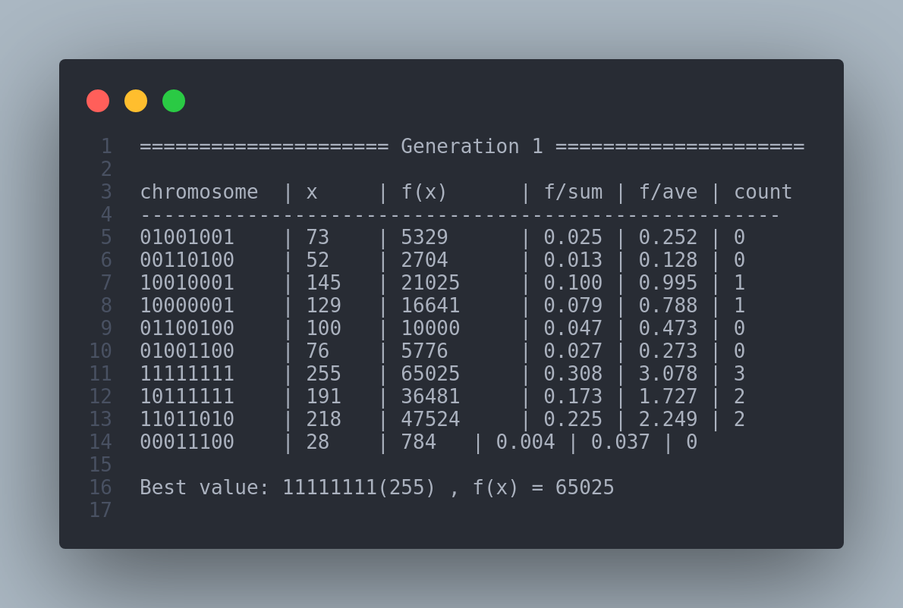

# Genetic Algorithm - f(x) = x^2

This is the first of three projects which use [Genetic Algorithm](https://en.wikipedia.org/wiki/Genetic_algorithm) to solve a certain problem.

Our target in this project is to maximize the value of the following function:

$$f(x) = x^2$$

We try to achieve this goal using **Genetic Algorithm** principles like mutation, crossover & etc and record this process.

A single generation of our programmed is shown as below:

